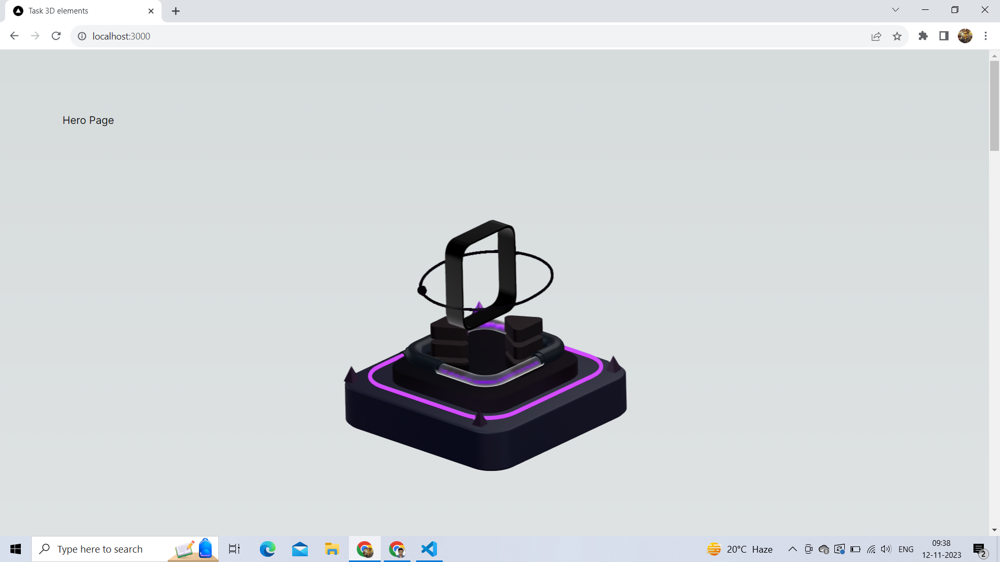
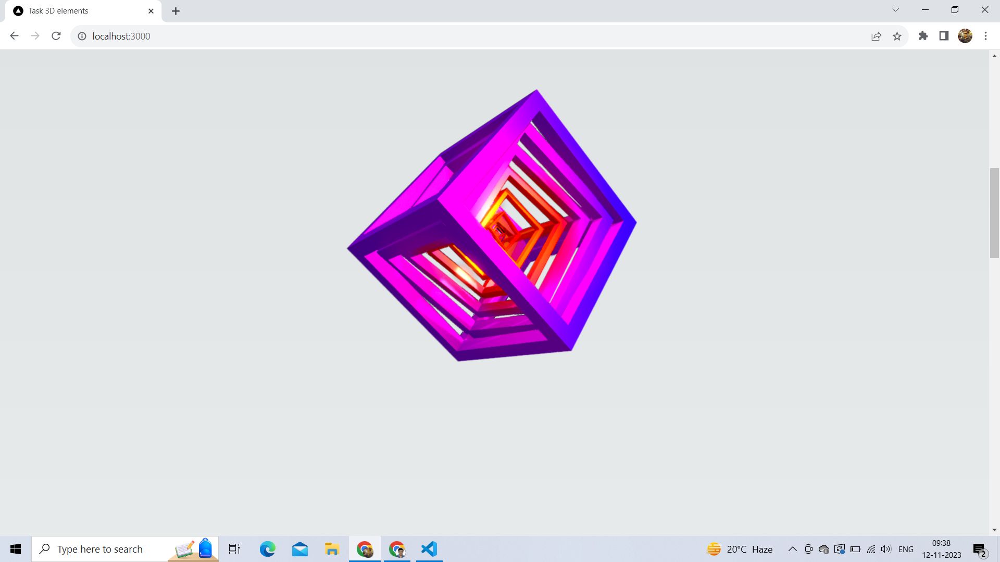
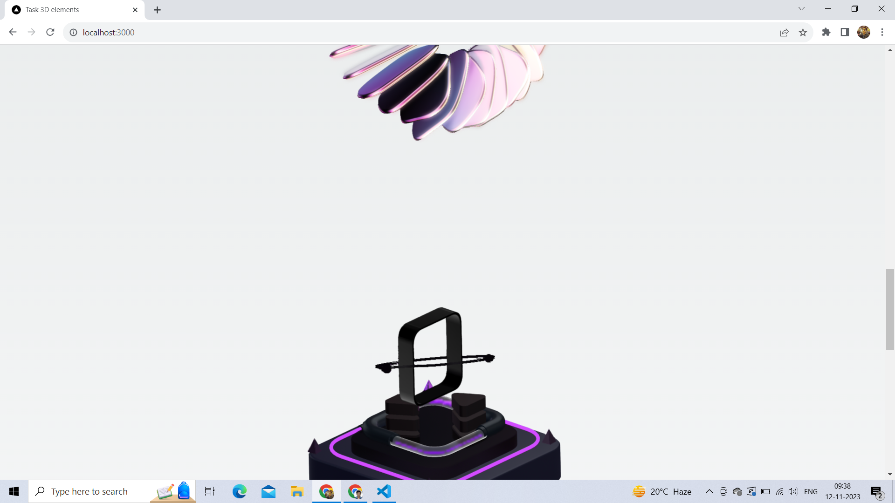
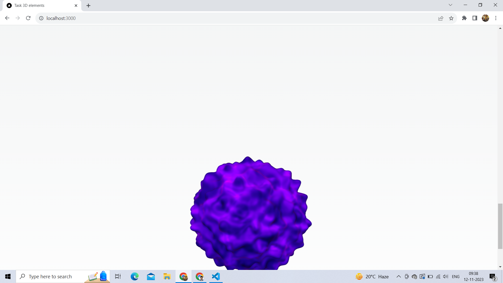

This is a [Next.js](https://nextjs.org/) project bootstrapped with [`create-next-app`](https://github.com/vercel/next.js/tree/canary/packages/create-next-app).

## Steps for running the next app
1. Clone the Repository
2. Navigate to the project folder
3. Install the necessary libraries
4. Run the application

#### 1. Clone the Repository
open the terminal and enter the command
git clone https://github.com/yogesh9245/project-task-loading-screen.git

#### 2. Navigate to the project folder
Open the project folder using the command
cd project-task-loading-screen

#### 3. Install the necessary libraries
I have used "@splinetool/react-spline" library in this project for embedding the 3D elements in my hero page
Run the command to install the library
npm install @splinetool/react-spline

#### 4.Run the application
To run the application, enter the command
npm run dev

After running the command open the browser and enter the url "http://localhost:3000".

## Project structure and Explaination
The App folder is the entry point of the application. The app/page.js will be displayed at the root path of the app. I have Created "components" folder inside the project ("project-task-loading-screen/components"). I have created a components for the Loading Screen inside it. The Loading Screen components will receive a prop called as loading percentage from the app/page.js which is indicative of the percentage of 3D elements loaded in the background. The Spline 3d elements have onload() method which is an asynchronous method which provides the loading status of the Spline 3d element. From this onload() method, I have determined the percentage of number of Spline 3D elements loaded in the background.

#### Screenshots from the app
![Alt text] (image-2.png)

![Alt text] (image-3.png)

![Alt text] (image-4.png)

